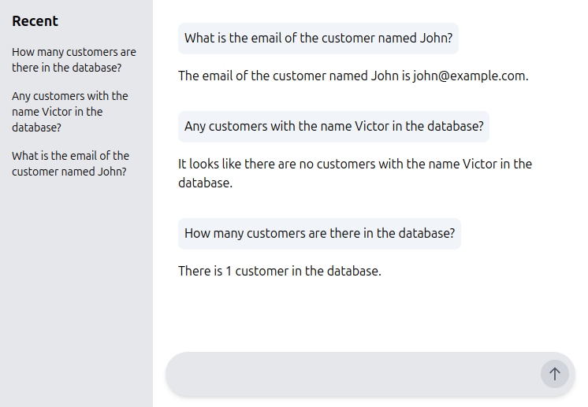

A chatbot that can answer questions using a database query.

It allows users to interact with databases by asking questions or describing information in natural language, and the system translates these inputs into structured database queries (like SQL).<br>
It's known as a **NLIDB** (Natural Language Interface to Database).

A typical flow of the system is as follows:
1. The user asks a question in natural language
2. The system translates the question into a structured query (like SQL)
3. The system executes the query on the database
4. The system formats the results and sends them back to the user 

These applications are transforming data access by making it more intuitive for non-technical users, combining NLP, query generation, and data visualization into a seamless process.



Possible questions (in the chat) and responses (in the log)
-----------------------------------------------------------
- What is the email of the customer named John?
```log
ai.demos.database.query.ChatController   : User Message: What is the email of the customer named John?
ai.demos.database.query.ChatController   : sql = SELECT email FROM customers WHERE LOWER(name) = 'john';
ai.demos.database.query.ChatController   : htmlResponse = <p>The email of the customer named John is john@example.com.</p>
```

- Any customers with the name Victor in the database?
```log
ai.demos.database.query.ChatController   : User Message: Any customers with the name Victor in the database?
ai.demos.database.query.ChatController   : sql = SELECT * FROM customers WHERE LOWER(name) = 'victor';
ai.demos.database.query.ChatController   : htmlResponse = <p>It looks like there are no customers with the name Victor in the database.</p>
```

- How many customers are there in the database?
```log
ai.demos.database.query.ChatController   : User Message: How many customers are there in the database?
ai.demos.database.query.ChatController   : sql = SELECT COUNT(*) FROM customers;
ai.demos.database.query.ChatController   : htmlResponse = <p>There is 1 customer in the database.</p>
 ```

Personal data
--------------------------------
The database used in this demo contains personal data (like names and emails).<br>
In the first versions the model's response:
```
I'm sorry, but I don't have access to personal data or emails of individuals" 
```
likely results from **built-in safety mechanisms** in OpenAI models.<br>
This response style is common with questions that involve identifying specific individuals or sensitive information like email addresses, 
even if the model has technically generated a valid SQL query to retrieve the data.
To avoid triggering these safeguards, try adjusting your prompt slightly to clarify that the email retrieval is part of a database simulation.

Of course, in a real-world application, you would need to ensure that your system is compliant with data privacy regulations like GDPR.
You don't want to expose personal data to unauthorized users or store it in an insecure way.