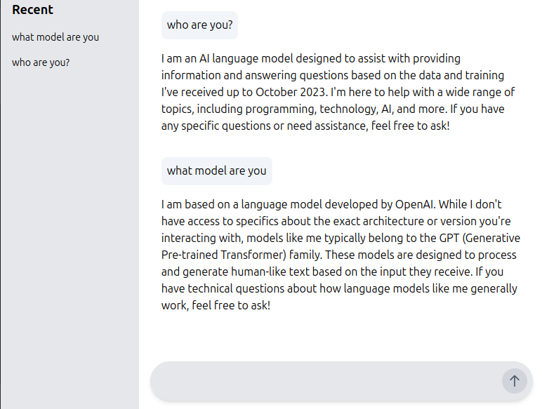

AI demo using [LangChain4j](https://docs.langchain4j.dev/intro/) and [Spring Boot](https://spring.io/projects/spring-boot).

This demo is a simple Spring Boot application that uses LangChain4j to create a chatbot that can answer questions.
Two models are used in this demo:
- OpenAI (in cloud)
- LLAMA3 (local model using [Ollama](https://ollama.com/library/llama3))



How to use OpenAI model
-------------------------
1. Get the API key from [OpenAI](https://platform.openai.com/docs/guides/authentication)
2. Set the API key in environment variable `OPENAI_API_KEY` or in `open-ai.properties` file
3. Comment the `ollama` profile in `application.properties` file
4. Comment the `langchain4j-ollama-spring-boot-starter` dependency in `pom.xml` file
5. Run the application using `./mvnw -pl langchain4j-spring-demo spring-boot:run`
6. Access the chatbot at `http://localhost:8080`
7. Ask questions to the chatbot
8. The chatbot will answer the questions using OpenAI model

How to use LLAMA3 model
-------------------------
1. Use docker to run the LLAMA3 model
```shell
docker-compose -f langchain4j-spring-demo/docker/docker-compose.yml -p docker up -d
```
2. Comment the `openai` profile in `application.properties` file
3. Comment the `langchain4j-openai-spring-boot-starter` dependency in `pom.xml` file
4. Run the application using `./mvnw -pl langchain4j-spring-demo spring-boot:run`
5. Access the chatbot at `http://localhost:8080`
6. Ask questions to the chatbot
7. The chatbot will answer the questions using LLAMA3 model

Read [readme.txt](./docker/readme.txt) for more details.

**Note**: Using LLAMA3 model requires more resources than OpenAI model. The answer may take longer time to generate.

UI
-----
The UI is a simple HTML page that uses JavaScript to send the question to the server and display the answer.
To keep the demo simple, the UI is generated using Thymeleaf template engine and Spring MVC (Server Side rendering).
[HTMX](https://htmx.org/) is used to send the question to the server without refreshing the page (AJAX calls).
However, you can use any front-end technology to create the UI.